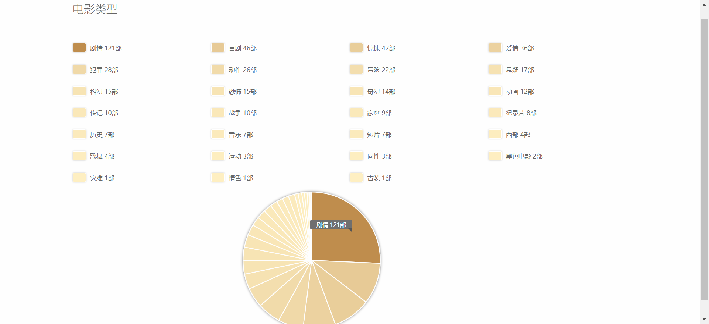
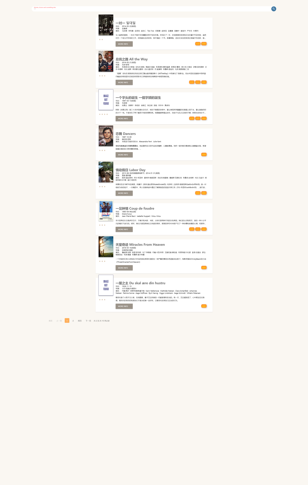
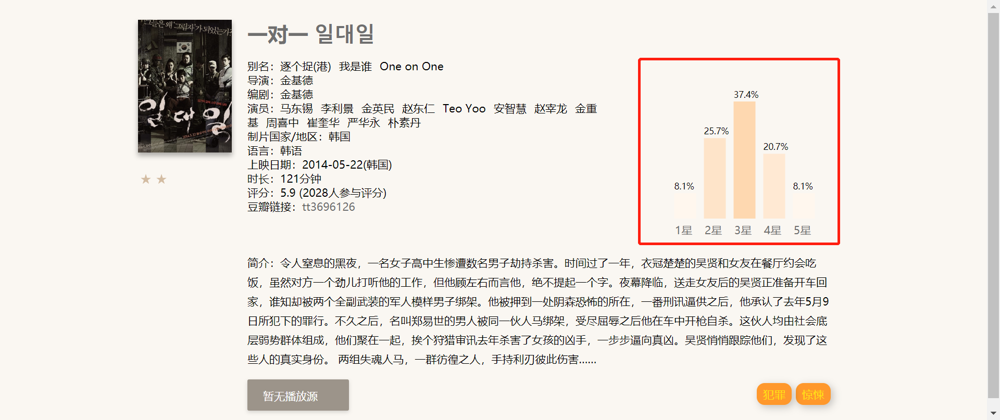

### Web第二次作业提交说明

1652667 梁栎鹏

#### 完成内容

###### 基本内容

- 修改JSON文件，完成JSON文件的解析（ref:[在Javascript中，如何读取外部的本地JSON文件？](https://vimsky.com/article/3575.html)）
- 完成分页功能 (ref:https://www.jq22.com/jquery-info21337 & https://www.jq22.com/jquery-info20964 根据需要整合，并做了部分改动)
- 布局合理，简洁美观 (使用**mdui库**制作卡片，ref: [布局组件–卡片](https://www.mdui.org/design/components/cards.html#)；使用codepen.io整合检索框，ref:[codepen.io](https://codepen.io/search/pens?q=search%20bar&page=1&order=popularity&depth=everything))

###### 附加内容

- 完成电影详情页
  - 解析详情；
  - 使用d3库，实现评分**可视化** (def: [D3.js-柱形图](https://blog.csdn.net/ligang2585116/article/details/52756567))。
- 搜索功能，并不限于对电影名搜索
  - 缩小并建立搜索域（如：省去_id等不必检索的字符）；
  - 使用lunr.js，建立快速索引，实现快速检索 (def:[为 lunr.js 添加中文支持](http://linfuyan.com/add-chinese-support-to-lunrjs/))；
  - 整合检索结果与分页，使得结果可分页展示。
- 数据统计及可视化
  - 实现电影类型的统计；
  - 使用d3库，实现统计结果可视化 (def: [codepen.io](https://codepen.io/arshdkhn1/pen/LbzPrZ))。

#### 内容展示

###### 按页面展示

- index.html

  tips: 点击搜索图标/ 按enter键即可搜索

  ​        点击类型可跳转至数据统计页面

  ​        点击More info可跳转详情页面

  

- details.html

  tips：实现评分可视化

  

- stats.html

  tips：鼠标放在饼状图上，会显示那一部分的详情信息（题材+数目）

  

###### 按功能展示

- 检索

  | 检索"一"                                        | 检索"二"                         |
  | ----------------------------------------------- | -------------------------------- |
  | 有15条记录，实现内容分页： | 有2条记录： |

- 评分可视化

  

- 统计&数据可视化

  - 统计题材，按照数目的多少，使颜色渐变

  

#### 提交内容

- src/css 文件夹 	包含：主页面与统计页面的css
  - index.css 	主页面
  - statistics.css    统计与可视化页面
- src/js    文件夹         包含：主页面、详情页面、分页、统计页面的js与三个库文件
  - d3.min.js                        d3   v4 用作数据可视化
  - jquery-3.3.1.min.js         jquery  v3.3.1
  - lunr.js                             lunr      用作快速检索
  - details.js                        详情界面
  - index.js                          主页面
  - statistics.js                     统计页面
  - pageMe.js                      分页 // according to https://www.jq22.com/jquery-info21337 & https://www.jq22.com/jquery-info20964 做了部分改动
- src/pic 文件夹            包含：图片不可用的默认图片
  - img-not-found.png （[图片地址](data:image/png;base64,iVBORw0KGgoAAAANSUhEUgAAAOEAAADhCAMAAAAJbSJIAAAAzFBMVEX///8AAFbY2OEAAGMAAF0AAFkAAGEAAFsAAF4AAFW9vda2ts6yssy0tMbDw9fZ2emFhaytrcxzc6Py8viRkbl8fKVNTYWKirSMjLLg4O3Q0OIAAGfHx9SkpLrJydsUFGtmZpBdXYoCAnCfn8Jzc5nb2+MAAE8KCmTr6/Nra59jY5sAAEvPz9o8PH+Wlrjv7/ckJHYuLng3N35JSYtRUYM8PHh2dqMTE2tWVpNDQ343N4UoKG9jY48rK31cXJMfH3iWlrE7O4VERHyBgbLVcVz7AAAIaklEQVR4nO3daXfiOBYGYAlJVzIQNofFmEASEjAJhK0KslRIpvv//6eR8IJrwjldlTLTuT56P5QXZMdP28iWsN2ESZrnSEbk2W0hv7k9k4TekjznlhJa+Lc34qQpWCH6WCH+WCH+WCH+WCH+WCH+WCH+WCH+WCH+WCH+WCH+WCH+WCH+WCH+WCH+WCH+WCH+WCH+WCH+WCH+WCH+WCH+WCH+WCH+WCH+WCH+WOH/I4HnBadbe6bC/s3NTTccnV7q8dpcjwU1PXZTTQqZDzbpha5Wy+VTMzEOb/a57GW0UZkKy46ixXD0zFGKv3l6rOpzxVUlLhOMlFKjwzJ1qkAp4NSLZkyEXpJz5yKjjcpWKBiPhYIB881WFzjTSYQloaeElyyzAgbf9T+8Gc1o6PIAIL6+EGYgzfNGPboYpITncrxlohhPVhjjG+I+Acyi41QL/VKpVPZINjmdUE2AGteQtmZwEG74QtMfkkUUU/rvv/NwhxMjhOusNsjklMKtqOuxjZi0UsJvajUB3oknLyTz9d+vK+ZHD5jhEfLGUjb02FrUrlQi9FbqryGoy3gRI9T1bJ2DE20GIuHfT/JRjz2L98uDsOurb12m4i9dImQDjk4oz3/IlR4by3pK2ONqNwcYxPVIJEwFkXDYkS/6/MdkMSUcSt4mg7CWNUEtrD/IgUuqIKsp4YTLIVmCiKdxC4diXCVFJd0fB+Eb0C5ZK3keTR8T6tpVx81oo04p1JcvFV1LCpKqSzmjgd6RahdNHxUySinvZ7RRp/wedqmqk3e5TQk9CuNAX9fALFrECD2v1ul0aodrGsa5ZBiEc4dfkI74T0pYFLBy9bUpvESL7IUVKTkfJWcL5m8ajc3Xv2rTNcqIv5NLMUkJh9IcnwXBxtGhGQmVPjLxnQ+H5Jpv5mv6kBLWuEYTz08u48Kj9PwOcApf+aO3oGcp4aWCq/f3GjBVD2dENY2+AEcp3MmV5/PpQRgsdWtQN28Zk+9hufiqDamwJv0C9bsHoXfNmGnAg2kU7oNcWBa8LpbeQVhw9OFZLBbvFDyHZ3Tkwp5UE/k0Pwh1gYEZPki4zoWwz2DBr8hBqLd+aYZ1wWgk1N/JAl5hdaErzZuUcK3UnRl2adxVU9KVTv1DXToPggDBdelQN+jDPrRE+ALhJbfrsKirJhgAbB+GV+nzIfNXq9Wy83H9n0rWQpkIxZC4LcWEllzxUOiNgYYdvQL4JCy4Eeb8oa9pUldtoJQSmw+r/1yyFcqxioWcD/UJHsayrIXg74UVGLPwj13rM39Y0L3TZw+ugN3FV95qbKKaH1b/uXyB3y269eGwXvnncp/MFxCeOFaIP1aIP1aIP1aIP1aIP1aIP6cVVi4uLs7c/TD5+SW42K3Xu/eoreRexCln1aj/n5xWeEWl2Hq6zeeMoh5g4m2lbt8quQqJARNyH7E40Z1fpxVe6ra73yWkw0Us3HGmHAeYDNv4wVhyYLqZL17RCs3PvRcyFlYHoFpkvojvEHLP2+0XgHWn/YDyKL1U24XpcjoI+4qp0r6bdBDd40fcFvCsuiyO5MRCvmzJdVrYo/s7wHrycCMYcuHThr/9JBT7nddnuRH+1Vb0qBDyIvxeB1nNt7DIZDnXwpk70JVpvoUrWcu1cDmfiJabZ+GgOhSv8zLPs3DqsKAEeRZ6Pi3kWxgsxLCYZ2GX7EQj58Ib+VTJt7AjvpfzLazTlzbLtbDrDB7HKeE2X60ns8Moe96mhKwYDnIkvIZBsg/7wPiZue1rvyv3QS4c9wl5NP1RkdBbArxVKsDgKe55wi1U5pCs8YNwf4cQGHKCQi28GjklQs7uHec+Frozam4RcnZJ5+F8Nho1TrYJJxa6rhsNUp2hxU2j8Xf/51In6is1sb/M4I8V4o8V4o8V4o8V4o8V4o8V/k6CaZj4bQJuv3M3afbc9OduMjDxTPFwGN9BZOYUClk9BEyyFZad/f/q2/kWTroTIXVLULZiYntE76vhIBI0R5TeB2bWqBbOqd7rNYC/bHQ/rP6TyVJYMrf+KCWjp2EalIEQcGjNn0vmGKFM3jG0b/0XzSfx+1yq1KwDgH/J5/G1EGaP63UocgcAi35/CRDf7XRcaO63aaeFsHp8YSx+LuqPk7Ewta6u3vjz/QOGPPpiHhUueM08xC4PQqH33k4xP6Otylo4TaaKodcMogPumBDW5qAuitQ+NLeJ1XXRjHo2TieMHgstqqSf7ZiQt+UsOCIUyX+XP82/LRQV6lfzLZwyUci1kBYWtJ5vYbATDVTCw7p+Tei4TTHTQolFCKv1eha+IekXheRBjjHtQ3PVJsIfIX5VWJbMxST0fZ/9ltDtSlWs4BHKsucVwsvQX6xpukTwMiLh79elFeLLd9fJtXAtGwHNtXAj1h5Fc7b4jPCMXhfy/T2cgsy5sLqV5/yIMKNXZZxOWE5awPGLLmMhZzQtDL7LifoodDJ60ut0wj5jcmjen8tE1ItRCd8stNM7NyqzF5If/BX4z70YTc5YRlt1OqHpiVoFXkvBINobgWDqyuu/ALxGZUJhk49Zqi5Vd+3HMUvejvmnOZ2Q7KR5abli8kc0w21xxn3QpeKXXYfCB8lYujdRcQVKFkk2ybhH+D71NvxgKczrkOTh4dDuQILeeDqJO5mao/uS/qreU/pTjzAVfquc0UZl26vfm/bSHWRB53mxeH5I1RjV5tvrYj1MCt1Oe/pTtzedTqO6Zz8+nXazu4XI/jKDP1aIP1aIP1aIP1aIP1aIP1aIP1aIP1aIP1aIP1aIP1aIP1aIP1aIP1aIP1aIP1aIP1aIP1aIP1aIP1aIP1aIP1aIP1aIP1aIP1aIP1aIP0Z4+8/FEOeWEnl2W8hvbs8kYZLmOZL9F78R1016swA+AAAAAElFTkSuQmCC)）
- src其它文件               包含：html与处理后的json文件
  - details.html    详情页面，需要从index页面进入
  - index.html      主页面
  - statistics.html 统计页面
  - films.js            经处理的film.json，以浏览器读入该json