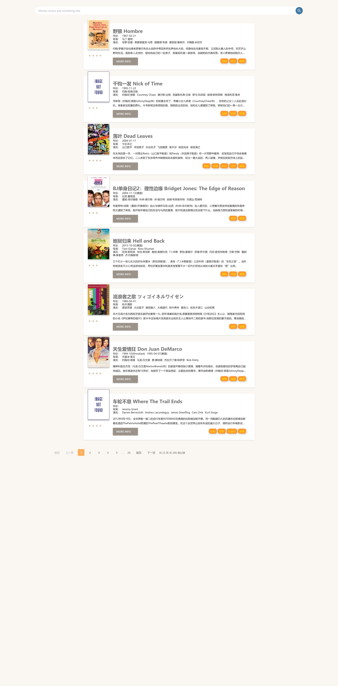
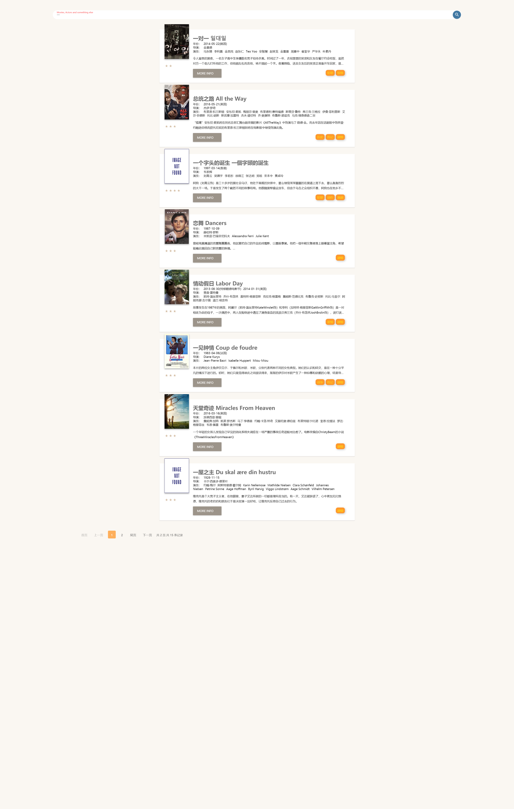
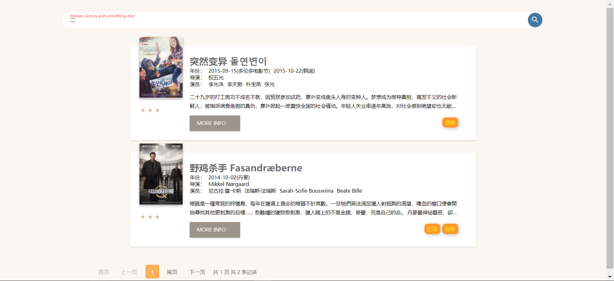
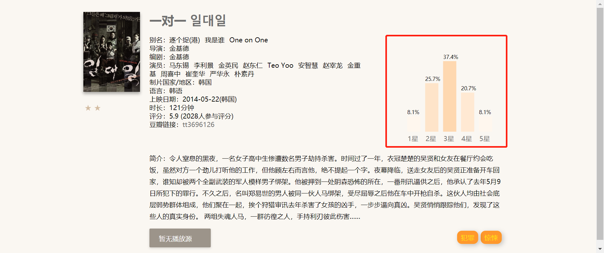
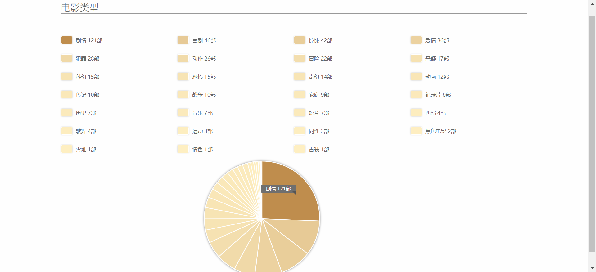

### Web第三次作业提交说明

1652667 梁栎鹏

#### 完成内容

- films_all.json写入MongoDB数据库
- 服务端访问数据库，客户端访问服务端接口，完成第二次作业时实现的功能；（主页、详情页面、分页面、数据可视化）
- 将项目部署至线上服务器：http://lpliang.info:5000/(172.96.228.146:5000)

#### 提交材料

- 项目源码
- 项目报告

#### 技术栈介绍

##### 后端

1. Flask

   后台框架

   <http://docs.jinkan.org/docs/flask/>

2. MongoDB

   提供数据存储

   <https://docs.mongodb.com/>

3. Whoosh

   提供数据索引

   <https://whoosh.readthedocs.io/en/latest/quickstart.html>

4. Jieba

   索引文本分词

   <https://github.com/fxsjy/jieba>

##### 前端

1. D3

   提供数据可视化

   <https://d3js.org/>

2. Jquery

   前端框架

   <https://jquery.com/>

#### 功能实现介绍

0. 使用Mongo数据存储，并建立文本索引

   **实现**：

   1. 启动后台服务时，从films_all.json读取数据

   2. 插入MongoDb

   3. 使用whoosh与jieba进行中文分词，并构建索引

      ```python
      schema = Schema(
          nid=ID(unique=True, stored=True),
          title=TEXT(phrase=False),
          tags=KEYWORD(lowercase=True, commas=True, scorable=True),
          people=KEYWORD(lowercase=True, commas=True, scorable=True),
      )
      ```

1. 主页与主页分页

   - index.html

     tips: 点击搜索图标/ 按enter键即可搜索

     点击类型可跳转至数据统计页面

     点击More info可跳转详情页面

     **实现**：

     1. 先通过访问`/`渲染主页；
     2. 通过访问`/films?start=<num>&limit=<num>`获取当前页面的所有电影json信息；
     3. 将json信息渲染至主页。

     

2. 详情页面

   - details.html

     tips：实现评分可视化

     **实现**：

     1. 先通过访问`details.html?id=<num>`跳转访问详情页面；
     2. 通过访问`/detail_data?id=<str>`获取当前电影的json信息；
     3. 将json信息渲染至详情页面。

     

3. 检索

   **实现**：

   1. 通过建立的索引，`/search?keyword=<str>&start=<num>&limit=<num>`访问获取总数据数目：

      ```python
      result = list(searcher.search(query))
              counts = len(result)
      ```

      

   2. 访问`/search?keyword=<str>&start=<num>&limit=<num>`，获取当前页码的所有电影的json：

      ```python
      # 防止起始索引、结束索引的越界
              start_index = (startPage - 1) * limit if (startPage - 1) * limit < counts else counts - 1
              end_index = startPage * limit if startPage * limit < counts else counts
      
              # 获取要显示的当前页面所有电影的索引值
              results = result[start_index:end_index]
      
              # result_list: 要显示的当前页面所有电影的json
              result_list = []
              for r in results:
                  result_list.append(files_collection().find_one({'_id': r['nid']}))
      ```

   | 检索"一"                                        | 检索"二"                         |
   | ----------------------------------------------- | -------------------------------- |
   | 有15条记录，实现内容分页： | 有2条记录： |

4. 数据可视化

   - 评分可视化

     **实现**：

     1. 使用返回的`/detail_data?id=<str>`的信息获得评分
     2. 使用D3构建评分可视化

     

   - 统计&数据可视化

     - 统计题材，按照数目的多少，使颜色渐变

     

#### 接口设计

1. `/`

   跳转至index.html

2. `/films?start=<num>&limit=<num>`

   主页获取电影数据：

   - `start`：从第几页开始
   - `limit`：一页最多有多少条数据

3. `/films_counts`

   获取电影总数

4. `/search?keyword=<str>&start=<num>&limit=<num>`

   通过关键词`keyword`检索电影

   - `keyword`：关键词
   - `start`：从搜索结果的第几页开始
   - `limit`：一页最多有多少条数据

5. `/detail_data?id=<str>`

   通过`id`获取页面详细数据

   - `id`：电影id

6. `/details.html?id=<num>`

   获取资源，跳转至详情页面


